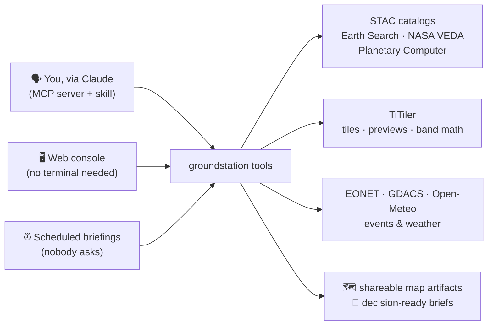
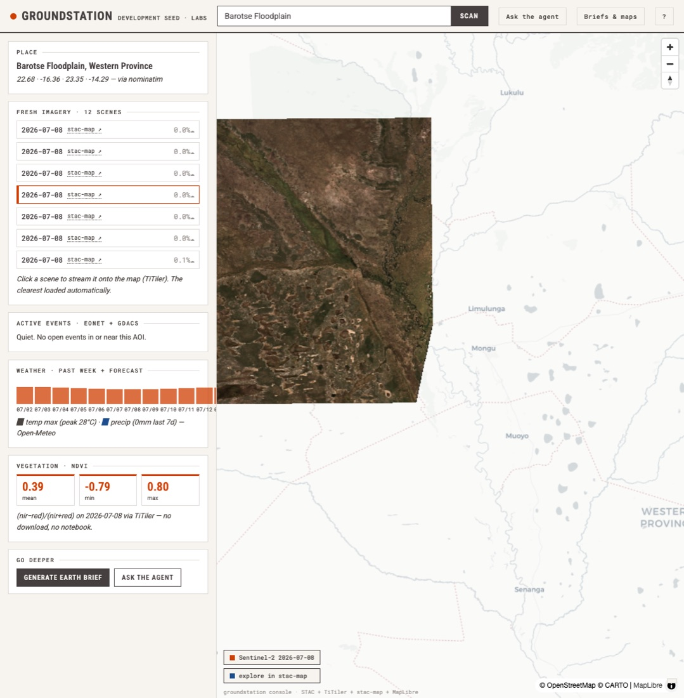
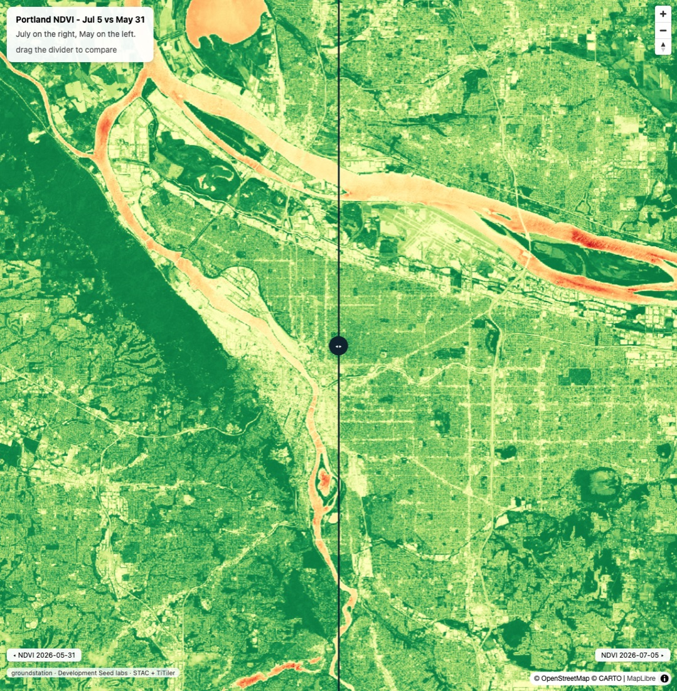

# groundstation

**Earth data, agent-ready.** A [Development Seed](https://developmentseed.org) labs prototype that puts the cloud-native geospatial stack in the hands of AI agents — and of anyone with a browser.

Ask a question about any place on Earth. groundstation finds the freshest satellite imagery, active fires and disaster alerts, and the weather, does the pixel math, and hands back an interactive map — through whichever door fits:



Everything runs against public, keyless endpoints — it demos anywhere, with nothing to sign up for.



## Real examples (all real runs, real data)

**"What's burning near Chelan County?"** — one scan found the two active wildfires (Navarre Coulee, Chelan Hills), correlated them with 14 straight days of zero rain and a 33°C heat peak in the forecast, and pointed at the three sub-1%-cloud scenes from ignition day.

**"How did vegetation change around Wenatchee?"** — one `compare_dates` call matched two scenes from the same Sentinel-2 tile (10TFT, both ~1% cloud) and answered: NDVI 0.46 → 0.63 between May 28 and July 5, a +36% spring green-up, with a swipe map to see it.

**"Watch these four places every morning."** — the fleet sweep triaged Chelan ACT (fires + heat), Efate and Laredo WATCH, Barotse CALM ("NDVI 0.397 → 0.395, normal dry-season drift, not a distress signal"). On its second run the Chelan brief opened with *"unchanged since this morning's earlier run"* — it remembers yesterday and only makes noise about what's new.



## Quickstart

**As a Claude Code plugin** (easiest — brings the MCP server and the earth-data skill together; requires [uv](https://docs.astral.sh/uv/)):

```
/plugin marketplace add dannybauman/groundstation
/plugin install groundstation@groundstation
```

First use after install takes a few seconds: `uv` builds the server's virtualenv on the first launch, so the tools appear a moment after Claude starts. If they don't show, run `/mcp` to confirm `groundstation` is connected — if it isn't, `/reload-plugins` or restart the session, and make sure `uv` is on your PATH.

Or skip the guessing and run the preflight:

```bash
scripts/doctor.sh
```

It walks the first-run chain in the order it actually breaks (uv, server env, CLI, plugin wiring, endpoints) and prints the exact fix for the first broken link. Setting up on a new machine or prepping a demo room? Run it before opening Claude.

**As an MCP server directly:**

```bash
git clone https://github.com/dannybauman/groundstation && cd groundstation && uv sync
claude mcp add groundstation -- uv --directory "$PWD" run groundstation
```

**The web console:**

```bash
uv run --group web groundstation-web   # open http://127.0.0.1:8765
```

**A brief, or the morning sweep:**

```bash
uv run briefing/brief.py --place "Chelan County, Washington" --days 10
uv run briefing/brief.py --fleet briefing/fleet.json                  # + --slack-webhook <url> to deliver
```

## Things to ask it

- "Find the clearest Sentinel-2 scene of Lake Chelan from the past two weeks, tell me what's burning nearby, and give me a map I can share."
- "How much surface water is on the Barotse Floodplain right now vs early March? Use NDWI, give me numbers and a swipe map."
- "What does NASA VEDA have on the Caldor fire? Put the burn severity layer over a current scene."
- "Show the newest NAIP aerial imagery of Des Plaines, Illinois with ESA WorldCover land cover as a toggle layer."
- "Any active flood alerts along the Rio Grande between El Paso and Laredo? Alerts, week-ahead rain, latest usable imagery, one map."
- "Compare vegetation in the Yirgacheffe coffee region between January and now, and tell me which scenes you'd trust."
- "Brief me on Efate, Vanuatu: open alerts, the week ahead, the most recent cloud-free scene, all on a map."

First `search_datasets` call takes ~20–30s while collection lists cache; everything after is instant.

## What an agent gets

| Tool | What it does | Backed by |
|---|---|---|
| `geocode` / `reverse_geocode` | place name ↔ coordinates + bbox, retries descriptive phrases | Gazet (when its JSON API lands), Nominatim |
| `list_catalogs` / `search_datasets` / `describe_collection` | find the right data across catalogs | Earth Search, NASA VEDA, Planetary Computer |
| `search_imagery` | recent items, cloud filtering, place names accepted | STAC APIs |
| `preview_item` / `tile_url_template` | browser-openable previews and XYZ tiles | titiler.xyz, VEDA raster API, PC data API |
| `compute_statistics` | band math over an item — NDVI is `(nir-red)/(nir+red)` | TiTiler statistics |
| `compare_dates` | **"what changed?"** in one call: same-tile scenes, index delta, swipe map | all of the above |
| `render_map` | self-contained interactive HTML maps; two rasters → automatic swipe compare | MapLibre + live tiles |
| `active_events` / `weather_summary` | open fires/floods/storms + past & coming week | NASA EONET, GDACS, Open-Meteo |

The paired skill in `skills/earth-data/` carries the judgment layer: which catalog for what, asset conventions, index-layer recipes, "always end spatial answers with a map."

## Earth briefs you

The briefing engine inverts the interaction — instead of you asking the right question, Earth reports in: fresh scenes, events, weather, an NDVI change signal against last month, a CALM/WATCH/ACT alert level, and suggested next steps, as a shareable HTML page. It keeps per-AOI memory so "what changed" means changed *since the last run*, fleet mode writes a triaged morning-sweep index, and `--slack-webhook` delivers the summary where people already look. Cron it and it runs while nobody's watching.

## Be a good neighbor: titiler.xyz

All tiling, previews, and pixel math ride **titiler.xyz** by default — a free, shared community endpoint that Development Seed runs as a demo. It rate-limits (HTTP 429) under heavy use, and a day of agent runs or a room full of people scanning places can hit that. Built-in mitigations: map artifacts carry scene footprint `bounds` so browsers never request out-of-footprint tiles, and statistics use small `max_size` reads.

**When to use your own tiler** — fleet briefings on a schedule, field-test-style batch runs, live demos to an audience, anything sustained:

```bash
docker compose up -d titiler                          # TiTiler is DevSeed OSS — one container (see compose.yml)
export GROUNDSTATION_TITILER=http://localhost:8000    # everything routes there
```

Any TiTiler deployment with the `/stac` router works (a hosted one, eoAPI's raster service, your own cloud instance). titiler.xyz is for kicking the tires; your own endpoint is for real work.

One caveat we learned in the field: some Earth Search collections (**NAIP, Landsat**) sit in requester-pays buckets. titiler.xyz carries AWS credentials for those; a local TiTiler returns 500s on them unless you provide your own AWS credentials (see `compose.yml`) — or just use Planetary Computer's copies of those datasets.

## Reliability

Three layers of checks, because a generative product without evals is a demo, not a tool:

- `uv run evals/unit_checks.py` — offline, deterministic; runs in CI on every push
- `uv run evals/run_evals.py` — 10 live checks against the real endpoints (on-demand + weekly CI)
- `uv run evals/brief_checks.py` — grounding checks on generated briefs: required sections, alert level, dates cited, and **every claimed event must exist in the input data** (hallucination guard)

## More

- `docs/examples.md` — the field test: twenty example prompts actually run through the agent, graded, with the improvements each round produced; visual walkthrough at `/docs/field-test.html` when the console is running
- `docs/architecture.md` — how it all fits together, design decisions, and what's deliberately not built
- Deep exploration hands off to [stac-map](https://github.com/developmentseed/stac-map) (Pete Gadomski), which renders COGs client-side via [deck.gl-raster](https://github.com/developmentseed/deck.gl-raster) (Kyle Barron); tiling and pixel math ride [TiTiler](https://github.com/developmentseed/titiler)
- A Development Seed labs prototype, July 2026
