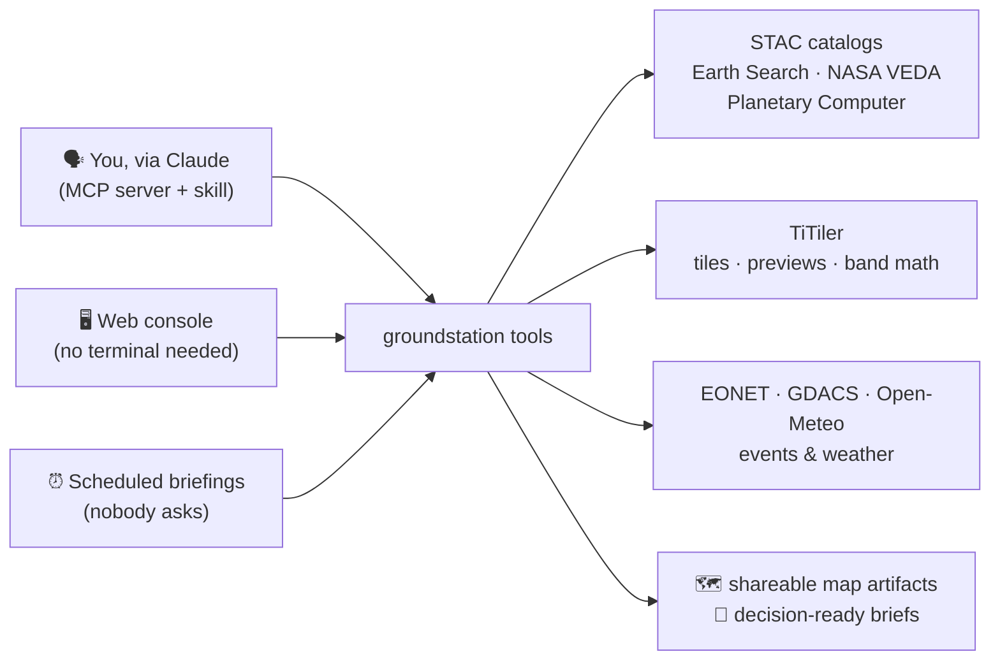
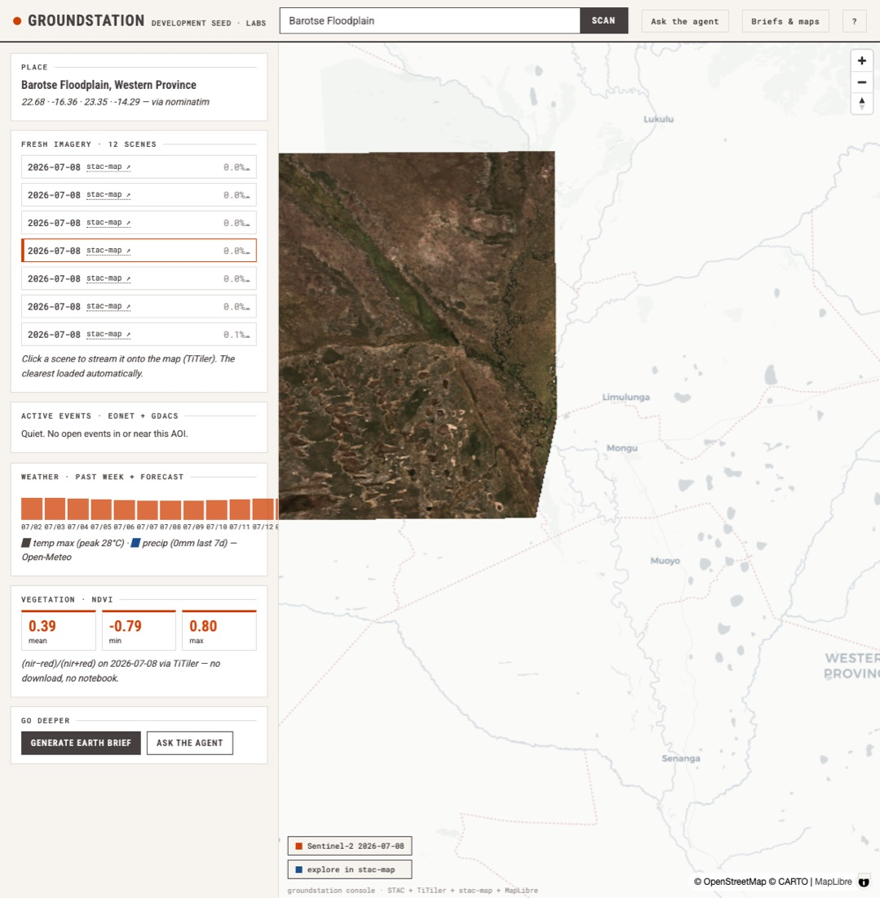
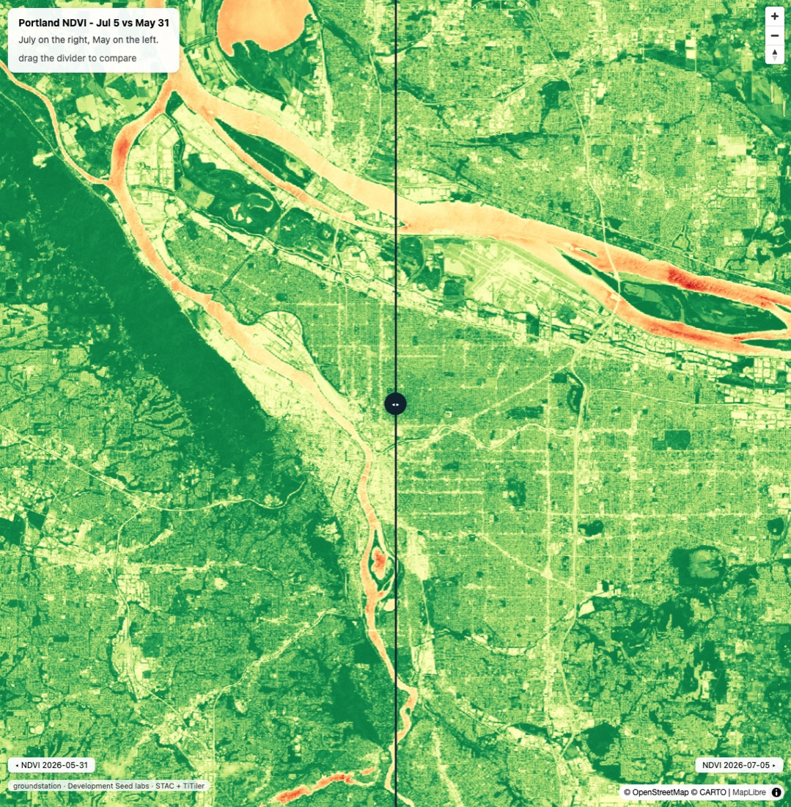

# groundstation

**Earth data, agent-ready.** A [Development Seed](https://developmentseed.org) labs prototype that puts the cloud-native geospatial stack in the hands of AI agents, and of anyone with a browser.

Ask a question about any place on Earth. groundstation finds the freshest satellite imagery, active fires and disaster alerts, and the weather, does the pixel math, and hands back an interactive map. There are 3 ways in:


```mermaid
flowchart LR
    A["🗣 You, via Claude<br/>(MCP server + skill)"] --> T
    B["🖥 Web console<br/>(no terminal needed)"] --> T
    C["⏰ Scheduled briefings<br/>(nobody asks)"] --> T
    T["groundstation tools"] --> D["STAC catalogs<br/>Earth Search · NASA VEDA<br/>Planetary Computer"]
    T --> E["TiTiler<br/>tiles · previews · band math"]
    T --> F["EONET · GDACS · Open-Meteo<br/>events & weather"]
    T --> G["🗺 shareable map artifacts<br/>📄 decision-ready briefs"]
```

Everything runs against public, keyless endpoints, so it demos anywhere with nothing to sign up for.



## Real examples

All 3 are real runs on real data.

**"What's burning near Chelan County?"** One scan found the 2 active wildfires (Navarre Coulee, Chelan Hills), correlated them with 14 straight days of zero rain and a 33°C heat peak in the forecast, and pointed at the 3 sub-1%-cloud scenes from ignition day.

**"How did vegetation change around Wenatchee?"** One `compare_dates` call matched 2 scenes from the same Sentinel-2 tile (10TFT, both about 1% cloud) and answered: NDVI 0.46 → 0.63 between May 28 and July 5, a +36% spring green-up, with a swipe map to see it.

**"Watch these 4 places every morning."** The fleet sweep triaged Chelan ACT (fires + heat), Efate and Laredo WATCH, Barotse CALM ("NDVI 0.397 → 0.395, normal dry-season drift, not a distress signal"). On its second run the Chelan brief opened with *"unchanged since this morning's earlier run"*. It remembers yesterday and only makes noise about what's new.



## Quickstart

You need [uv](https://docs.astral.sh/uv/). Then, in Claude Code:

```
/plugin marketplace add dannybauman/groundstation
/plugin install groundstation@groundstation
```

That brings the MCP server and the skills together. The first launch builds the server's environment, so the tools appear a few seconds after Claude starts. Then ask for a map of your hometown.

If the tools don't show up, run the preflight. It walks the setup chain in the order it breaks (uv, server env, CLI, plugin wiring, endpoints) and prints the fix for the first broken link:

```bash
bash scripts/doctor.sh
```

The other ways to run it:

```bash
# as a plain MCP server
git clone https://github.com/dannybauman/groundstation && cd groundstation && uv sync
claude mcp add groundstation -- uv --directory "$PWD" run groundstation

# the web console, at http://127.0.0.1:8765
uv run --group web groundstation-web

# a brief for one place, or the morning sweep over a watch list
uv run briefing/brief.py --place "Chelan County, Washington" --days 10
uv run briefing/brief.py --fleet briefing/fleet.json
```

With the plugin installed you can also just ask. "demo groundstation", "is groundstation running", "open the field tests" and "brief me on Lisbon" all run through the `groundstation` skill, with no commands to remember.

### Updating

Plugin installs are cached per version, so an installed copy stays as it was until you update it:

```bash
claude plugin marketplace update groundstation
claude plugin update groundstation@groundstation
```

Then restart Claude Code. If you installed with `claude mcp add`, `git pull` in your clone and restart. `scripts/doctor.sh` says which copy you are running and whether it is behind.

## Things to ask it

- "Find the clearest Sentinel-2 scene of Lake Chelan from the past 2 weeks, tell me what's burning nearby, and give me a map I can share."
- "How much surface water is on the Barotse Floodplain right now vs early March? Use NDWI, give me numbers and a swipe map."
- "What does NASA VEDA have on the Caldor fire? Put the burn severity layer over a current scene."
- "Any active flood alerts along the Rio Grande between El Paso and Laredo? Alerts, week-ahead rain, latest usable imagery, one map."
- "Give me a 3D fly-through of Torres del Paine."
- "Make me a postcard of that I could post."

The first `search_datasets` call takes 20 to 30 seconds while collection lists cache. After that it is instant.

## What an agent gets

| Tool | What it does | Backed by |
|---|---|---|
| `geocode` | place name to coordinates and a bbox | the fuzzy index in Gazet, Development Seed's geocoder (Overture divisions, urban centres, Natural Earth), with Nominatim as the fallback |
| `list_catalogs` / `search_datasets` / `describe_collection` | find the right data across catalogs | Earth Search, NASA VEDA, Planetary Computer |
| `search_imagery` | recent scenes with cloud filtering, plus the scene to start from and why | STAC APIs |
| `preview_item` / `tile_url_template` | browser-openable previews and XYZ tiles | titiler.xyz, VEDA raster API, PC data API |
| `compute_statistics` | band math over a scene: NDVI is `(nir-red)/(nir+red)` | TiTiler statistics |
| `compare_dates` | "what changed?" in one call: same-tile scenes, index delta, swipe map | all of the above |
| `render_map` | self-contained interactive HTML maps. 2 rasters become a swipe compare | MapLibre + live tiles |
| `render_map_3d` | terrain fly-throughs: imagery draped over real relief | MapLibre terrain + keyless AWS Terrarium tiles |
| `render_postcard` | share cards with the pixels embedded and attribution baked in, so nothing expires | TiTiler previews |
| `active_events` / `weather_summary` | open fires, floods and storms, plus the past and coming week of weather | NASA EONET, GDACS, Open-Meteo |
| `next_pass` | when a satellite could next image a place | Celestrak orbits, following [eo-predictor](https://github.com/developmentseed/eo-predictor) |
| `conditions_brief` | current conditions around a place in one call: dryness, wind, events, the latest look, the next pass | the tools above |

The tools say when not to trust them. A tool that returns a derived number also returns, on the same object, the conditions under which it should not be read at face value: a cloudy scene behind a change figure, statistics that cover a whole tile, a scene the tiler cannot read. The rule is in `docs/adr-caveats.md`.

Every artifact carries a Stack panel. It shows the pipeline that made it, in order, with only the components that actually ran and Development Seed's own listed first. `docs/stack.md` is the curated source, and adding a tool is one entry.

The skills in `skills/` carry the judgment: which catalog for what, asset conventions, index recipes, and "always end a spatial answer with a map".

## Earth briefs you

The briefing engine inverts the interaction. Instead of you asking the right question, Earth reports in. Each brief has fresh scenes, events, weather, an NDVI change signal against last month, a CALM, WATCH or ACT level, and suggested next steps, as a shareable HTML page. It keeps a memory per place, so "what changed" means changed since the last run.

Scheduling it with cron or launchd, Slack delivery, and running the synthesis on a local model are in `docs/briefing.md`.

## Be a good neighbor: titiler.xyz

All tiling, previews and pixel math ride **titiler.xyz** by default, a free shared endpoint that Development Seed runs as a demo. It rate-limits (HTTP 429) under heavy use. For scheduled briefings, batch runs, or a demo to a room, run your own:

```bash
docker compose up -d titiler                          # TiTiler is one container, see compose.yml
export GROUNDSTATION_TITILER=http://localhost:8000    # everything routes there
```

Any TiTiler deployment with the `/stac` router works. One caveat: NAIP and Landsat on Earth Search are in requester-pays buckets. titiler.xyz carries AWS credentials for those, and a local TiTiler returns 500s on them unless you provide your own (see `compose.yml`), or use Planetary Computer's copies.

## Reliability

3 layers of checks, because a generative product without evals is a demo, not a tool:

- `uv run evals/unit_checks.py`: offline and deterministic, runs in CI on every push
- `uv run evals/run_evals.py`: live checks against the real endpoints, on demand and weekly in CI
- `uv run evals/brief_checks.py`: grounding checks on generated briefs. Every claimed event must exist in the input data

## More

- `docs/examples.md`: the field tests. Real prompts run through the agent and graded, with the fixes each round produced. The pages are at `/docs/field-test.html` when the console is running
- `docs/architecture.md`: how it fits together, the design decisions, and what is deliberately not built
- Deep exploration hands off to [stac-map](https://github.com/developmentseed/stac-map) (Pete Gadomski), which renders COGs client-side with [deck.gl-raster](https://github.com/developmentseed/deck.gl-raster) (Kyle Barron). Tiling and pixel math ride [TiTiler](https://github.com/developmentseed/titiler)

MIT licensed, see `LICENSE`.
