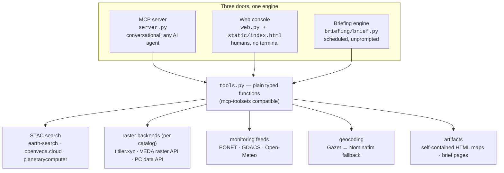

# How groundstation fits together

The one-sentence version: **plain Python functions over public geo APIs, exposed through three doors, with evals keeping everything honest.**

## The shape



Everything important lives in `src/groundstation/tools.py` as plain functions with type hints and docstrings. The MCP server registers them verbatim; the web console wraps them in FastAPI endpoints; the briefing engine imports them directly. One implementation, three surfaces — a fix lands everywhere at once.

## Design decisions (and the reasons)

**No GDAL, no heavy geo dependencies.** The only runtime deps are `mcp` and `httpx`. All pixel work happens server-side in TiTiler; all rendering happens in the browser via live tile URLs. This is why the whole thing installs in seconds and demos on any machine.

**Per-catalog raster routing.** Earth Search items tile through titiler.xyz, NASA VEDA through its own raster API, Planetary Computer through its signing data API (their assets need SAS tokens; their API handles it). This federated-**and**-preview-capable combination is the thing neither `nasa/earthdata-mcp` nor community `stac-mcp` servers have.

**Expressions use asset names, not band indices.** You write `(nir-red)/(nir+red)`; a shared helper translates to TiTiler's merged-band form (`(b1-b2)/(b1+b2)` + `assets=nir&assets=red`) for both statistics and tiles. Agents improvising raw band URLs was the root cause of a real "blank layer" bug — the recipe now lives in one function and the skill.

**Map artifacts are static HTML, deliberately.** A generated map is a single file with live tile URLs — shareable, hostable anywhere, no server of ours in the loop. When a map has exactly two raster layers it automatically renders as a swipe comparison (two synced MapLibre maps; CSS `clip-path` divides them and conveniently clips pointer events too, so both halves stay interactive). One raster gets checkbox toggles instead.

**Briefs remember.** Each AOI keeps a small state file (`briefing/state/`, gitignored); the next run diffs against it, so "what changed" means changed since the last run, and a calm day after a WATCH day says so explicitly. The gathered-data snapshot is saved next to every brief for the grounding evals.

**The interpretation layer is honest by construction.** The console's "What this means" card and the briefs both receive *only* the gathered data plus the user's query, and their prompts require citing dates/numbers from the data and naming limits. The brief evals then verify it: any event name in the output that isn't in the input data is flagged as a possible hallucination and fails the check.

## What is deliberately not built

- **A STAC browser or raster renderer** — deep exploration hands off to [stac-map](https://github.com/developmentseed/stac-map) (which brings [deck.gl-raster](https://github.com/developmentseed/deck.gl-raster) client-side COG rendering), via `?href=` deep links and an embedded panel.
- **A geocoder** — Gazet is Development Seed's small-model geocoder; `GAZET_URL` activates it the moment a JSON endpoint is exposed. Nominatim (with descriptive-phrase retries) is the fallback, not the destination.
- **Hosted deployment** — the tool functions follow the `developmentseed/mcp-toolsets` shape (typed args, docstrings as descriptions, JSON returns) so they can drop into that scaffold's streamable-HTTP runtime when it's time.
- **Auth** — all endpoints are public by design for the prototype; protected-data support is a planned follow-on using per-user credential passthrough.

## The three doors, when to use which

| Door | Who it's for | What it's best at |
|---|---|---|
| MCP server + skill | anyone in Claude (or any MCP client) | exploratory questions, custom analysis, "watch it think" |
| Web console | demos, partners, no-terminal users | the golden path: scan a place → imagery + events + weather + meaning |
| Briefing engine | schedulers, channels, ambient monitoring | Earth reporting in unprompted, triaged across a fleet of AOIs |

## Reliability model

| Layer | File | When it runs | What breaks it |
|---|---|---|---|
| unit checks | `evals/unit_checks.py` | CI, every push | logic regressions (expression translation, map templates, brief parsing) |
| live evals | `evals/run_evals.py` | on demand + weekly CI | an upstream endpoint changed or broke — the demo is down *right now* |
| brief grounding | `evals/brief_checks.py` | after brief runs | a generated brief that isn't structurally complete or grounded in its data |

The split matters: unit failures mean *we* broke it, live failures mean *the world* changed, grounding failures mean *the model* drifted. Different failures, different fixes.

## File map

```
src/groundstation/
  tools.py        # everything real: the tool functions
  server.py       # MCP wrapper (FastMCP, stdio)
  web.py          # FastAPI console backend + job runner
  static/index.html  # the console (single file, DS poster design language)
skills/earth-data/SKILL.md   # the judgment layer for agents
briefing/brief.py            # brief + fleet + Slack delivery
briefing/fleet.json          # example AOI watch list
evals/                       # unit + live + grounding checks
.claude-plugin/ + .mcp.json  # Claude Code plugin packaging
```
