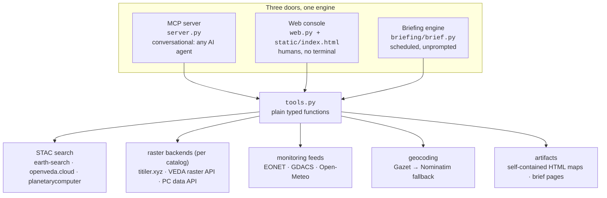

# How groundstation fits together

The one-sentence version: **plain Python functions over public geo APIs, exposed through three doors, with evals keeping everything honest.**

## The shape


```mermaid
flowchart TD
    subgraph doors [Three doors, one engine]
        MCP["MCP server<br/><code>server.py</code><br/>conversational: any AI agent"]
        WEB["Web console<br/><code>web.py + static/index.html</code><br/>humans, no terminal"]
        BRIEF["Briefing engine<br/><code>briefing/brief.py</code><br/>scheduled, unprompted"]
    end
    TOOLS["<code>tools.py</code><br/>plain typed functions"]
    MCP --> TOOLS
    WEB --> TOOLS
    BRIEF --> TOOLS
    TOOLS --> STAC["STAC search<br/>earth-search · openveda.cloud · planetarycomputer"]
    TOOLS --> RASTER["raster backends (per catalog)<br/>titiler.xyz · VEDA raster API · PC data API"]
    TOOLS --> MON["monitoring feeds<br/>EONET · GDACS · Open-Meteo"]
    TOOLS --> GEO["geocoding<br/>Gazet → Nominatim fallback"]
    TOOLS --> OUT["artifacts<br/>self-contained HTML maps · brief pages"]
```

Everything important lives in `src/groundstation/tools.py` as plain functions with type hints and docstrings. The MCP server registers them verbatim; the web console wraps them in FastAPI endpoints; the briefing engine imports them directly. One implementation, three surfaces — a fix lands everywhere at once.

## Design decisions (and the reasons)

**Thin by default, with 3 heavier dependencies that each buy one thing.** Almost all pixel work happens server-side in TiTiler, and maps render in the browser from live tile URLs, so the core needs only `mcp` and `httpx`. 3 imports are heavier, and each is loaded only by the tool that needs it: `rio-tiler` reads COGs directly to bake a mosaic postcard from several scenes, `skyfield` propagates orbits for `next_pass`, and `playwright` snapshots a rendered map for a share card. rio-tiler brings rasterio and its GDAL wheels, so the install is no longer GDAL-free. `mcp` is pinned below 2 because the 2.x SDK renamed the server class this code imports.

**titiler.xyz is a shared community endpoint — treat it accordingly.** It rate-limits (429s) under heavy use, which a day of agent runs and eval suites can trigger. Two mitigations are built in: map artifacts carry each scene's footprint `bounds` so the browser never requests (and the tiler never serves 404s for) out-of-footprint tiles, and `GROUNDSTATION_TITILER` points everything at your own TiTiler deployment — it's Development Seed's own open source, and running one is a single container. For demos to an audience, deploy your own.

**Per-catalog raster routing.** Earth Search items tile through titiler.xyz, NASA VEDA through its own raster API, Planetary Computer through its signing data API (their assets need SAS tokens; their API handles it). When this was built in July 2026, neither `nasa/earthdata-mcp` nor the community `stac-mcp` servers combined federated search with previews. That has not been rechecked against the servers released since.

**Expressions use asset names, not band indices.** You write `(nir-red)/(nir+red)`; a shared helper translates to TiTiler's merged-band form (`(b1-b2)/(b1+b2)` + `assets=nir&assets=red`) for both statistics and tiles. Agents improvising raw band URLs was the root cause of a real "blank layer" bug — the recipe now lives in one function and the skill.

**Map artifacts are static HTML, deliberately.** A generated map is a single file with live tile URLs — shareable, hostable anywhere, no server of ours in the loop. When a map has exactly two raster layers it automatically renders as a swipe comparison (two synced MapLibre maps; CSS `clip-path` divides them and conveniently clips pointer events too, so both halves stay interactive). One raster gets checkbox toggles instead.

**Briefs remember.** Each AOI keeps a small state file (`briefing/state/`, gitignored); the next run diffs against it, so "what changed" means changed since the last run, and a calm day after a WATCH day says so explicitly. The gathered-data snapshot is saved next to every brief for the grounding evals.

**The interpretation layer is honest by construction.** The console's "What this means" card and the briefs both receive *only* the gathered data plus the user's query, and their prompts require citing dates/numbers from the data and naming limits. The brief evals then verify it: any event name in the output that isn't in the input data is flagged as a possible hallucination and fails the check.

**A derived number carries its caveat.** A tool that returns a mean, a delta or a coverage figure also returns, on the same object, the conditions under which it should not be read at face value. The key is absent when nothing applies, so its presence is the signal. The rule and the audit of every tool are in [adr-caveats.md](adr-caveats.md).

## What is deliberately not built

- **A STAC browser or raster renderer** — deep exploration hands off to [stac-map](https://github.com/developmentseed/stac-map) (which brings [deck.gl-raster](https://github.com/developmentseed/deck.gl-raster) client-side COG rendering), via `?href=` deep links and an embedded panel.
- **A geocoder** — Gazet is Development Seed's geocoder and answers first, through the JSON API on its Hugging Face Space (`GAZET_URL` to point elsewhere): a no-LLM fuzzy match over Overture divisions, urban centres and Natural Earth, gated on similarity so a near miss falls through. Nominatim (with descriptive-phrase retries) is the fallback for landmarks, small places and phrases, not the destination.
- **Hosted deployment** — groundstation runs locally over stdio. One route to a hosted service is Development Seed's [`mcp-toolsets-runtime`](https://github.com/developmentseed/mcp-toolsets-runtime). The tool functions are close to its contract (typed args, docstrings as descriptions, JSON returns) but do not drop in as written: the runtime wants each tool async, declared as a LangChain tool, and returning its own result type, so a port is a thin wrapper per tool.
- **Auth** — all endpoints are public by design for the prototype; protected-data support is a planned follow-on using per-user credential passthrough.

## The three doors, when to use which

| Door | Who it's for | What it's best at |
|---|---|---|
| MCP server + skill | anyone in Claude (or any MCP client) | exploratory questions, custom analysis, "watch it think" |
| Web console | demos, partners, no-terminal users | the golden path: scan a place → imagery + events + weather + meaning |
| Briefing engine | schedulers, channels, ambient monitoring | Earth reporting in unprompted, triaged across a fleet of AOIs |

## Reliability model

| Layer | File | When it runs | What breaks it |
|---|---|---|---|
| unit checks | `evals/unit_checks.py` | CI, every push | logic regressions (expression translation, map templates, brief parsing) |
| live evals | `evals/run_evals.py` | on demand + weekly CI | an upstream endpoint changed or broke — the demo is down *right now* |
| brief grounding | `evals/brief_checks.py` | after brief runs | a generated brief that isn't structurally complete or grounded in its data |

The split matters: unit failures mean *we* broke it, live failures mean *the world* changed, grounding failures mean *the model* drifted. Different failures, different fixes.

## Modularity: where each kind of knowledge lives

The skill layer is split by scope, mirroring [the modularity RFC](rfc-modularity.md): `skills/stac-api/` and `skills/titiler/` carry *service-adapter* knowledge (how to drive any spec-compliant instance — candidates to upstream to the service projects), `skills/earth-data/` keeps the *cross-service judgment* (catalog routing, requester-pays workarounds, composition recipes) that no single-service skill can hold. The `selfdoc` compose service prototypes the third layer: a deployment serving its own quirks and skills at a well-known URL.

## File map

```
src/groundstation/
  tools.py        # everything real: the tool functions
  server.py       # MCP wrapper (FastMCP, stdio)
  stack.py        # reads docs/stack.md and builds each artifact's Stack panel
  web.py          # FastAPI console backend + job runner
  static/index.html  # the console (single file, DS poster design language)
skills/earth-data/SKILL.md   # the judgment layer for agents (cross-service)
skills/stac-api/SKILL.md     # service-level: any STAC API instance
skills/titiler/SKILL.md      # service-level: any TiTiler instance
skills/groundstation/SKILL.md  # runs and demos it: doctor, console, briefs
selfdoc/llms.txt             # self-documenting-instance prototype (compose: selfdoc)
briefing/brief.py            # brief + fleet + Slack delivery
briefing/fleet.json          # example AOI watch list
evals/                       # unit + live + grounding checks
scripts/doctor.sh            # preflight: walks the setup chain, prints the first fix
scripts/field_test.py        # cases JSON in, the field-test page out
docs/                        # stack.md (attribution source), ADRs, briefing.md, field tests
.claude-plugin/ + .mcp.json  # Claude Code plugin packaging
```
